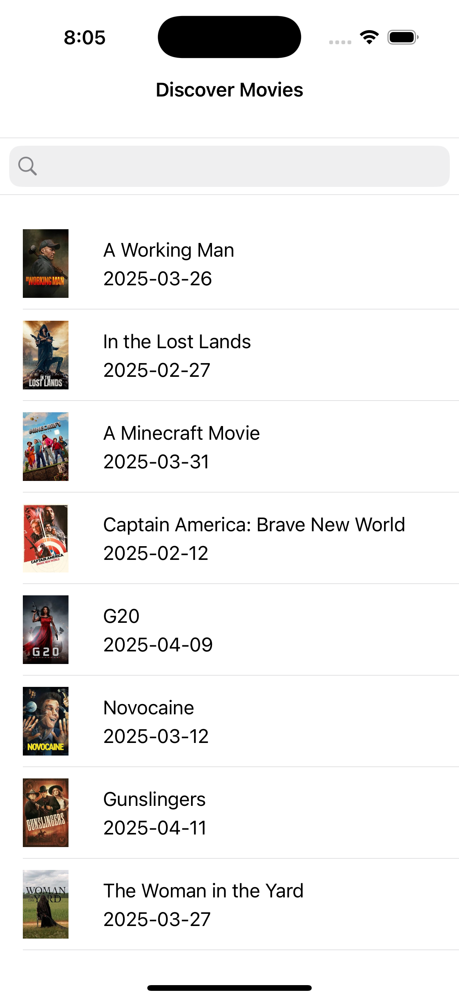

# 🎬 Movie Discovery App

A simple iOS app that lets users search and discover movies using [The Movie Database (TMDB)](https://www.themoviedb.org/) API.

## 🛠 Features

- 🔍 Search for movies by title
- 🎞 View movie list with poster, title, and release date
- 📄 Tap on a movie to view detailed info (poster, title, overview, release date)
- 🧠 MVVM architecture
- 🧩 Storyboard-based UI using UIKit
- 📡 Networking with URLSession
- 🖼 Async image loading using SDWebImage
- ✅ Unit tests for ViewModel logic
- ⌨️ IQKeyboardManager for smooth keyboard handling

## 🧱 Tech Stack

- Swift
- UIKit + Storyboards
- MVVM Design Pattern
- URLSession for networking
- SPM - SDWebImage
- SPM - IQKeyboardManagerSwift
- XCTest for unit testing

## 📸 Screenshots

| Movie List | Movie Details |
|------------|---------------|
|  |  |
